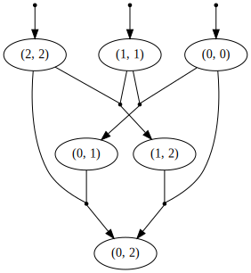

# Hypergraphs

A reference implementation of weighted hypergraph algorithms — inside,
outside, inside–outside, $k$-best, and sampling — parameterized by an
arbitrary [semiring](https://github.com/timvieira/semirings). The emphasis
is clarity and generality over performance: one dynamic program, swap the
weight type, and you get shortest path, Viterbi, marginals, $k$-best,
sampling, expectations, or the convex hull for MERT.

## Hypergraphs, Briefly

> A finite-state automaton is a compact representation of a (possibly
> infinite) **set of strings**. A hypergraph is a compact representation of a
> (possibly infinite) **set of derivations** — that is, trees.

Fix a semiring $(\mathbb{K}, \oplus, \otimes, \mathbf{0}, \mathbf{1})$. A
weighted hypergraph is a tuple $H = (V, E, r)$ with a finite node set $V$,
a distinguished root $r \in V$, and a finite set of hyperedges $E$. Each
$e \in E$ has the form

$$e \;=\; \Big(\, h(e) \;\xleftarrow{\,w(e)\,}\; b_1(e)\, b_2(e)\, \ldots\, b_{n(e)}(e) \,\Big),$$

with head $h(e) \in V$, body $\big(b_i(e)\big)_{i=1}^{n(e)} \in V^{\ast}$, and
weight $w(e) \in \mathbb{K}$. A hyperedge with empty body ($n(e) = 0$) plays
the role of a terminal.

The set of derivations rooted at $v$ is defined inductively as

$$D(v) \;=\; \bigsqcup_{e\,:\,h(e) \,=\, v}\; \Big\{\,(e,\, d_1,\, \ldots,\, d_{n(e)}) \;:\; d_i \in D\big(b_i(e)\big)\,\Big\},$$

with the empty-body case grounding the recursion: if $n(e) = 0$ then the
set on the right reduces to $\{(e)\}$. Each derivation is a tree; its
weight is

$$w\big((e, d_1, \ldots, d_n)\big) \;=\; w(e) \otimes w(d_1) \otimes \cdots \otimes w(d_n),$$

which under $n = 0$ is simply $w(e)$ (empty $\otimes$-product equals
$\mathbf{1}$). The inside value at $v$ is

$$\beta(v) \;=\; \bigoplus_{d \,\in\, D(v)} w(d) \;=\; \bigoplus_{e\,:\,h(e) \,=\, v}\, w(e) \otimes \bigotimes_{i=1}^{n(e)} \beta\big(b_i(e)\big),$$

computed bottom-up; the partition function is $Z = \beta(r)$. The outside
value $\alpha(v)$ is the complementary sum over partial derivations with $v$
plugged in at the root, and together $\alpha, \beta$ give node and edge
marginals (inside–outside). Evaluating inside under $\texttt{LazySort}$
yields $k$-best enumeration; evaluating it under a sampling semiring yields
exact samples.

The advanced semiring machinery follows Li & Eisner (2009),
[*First- and Second-Order Expectation Semirings*](https://cs.jhu.edu/~jason/papers/li+eisner.emnlp09.pdf).


## Install

```bash
pip install git+https://github.com/timvieira/hypergraphs
```

## Example: Matrix-Chain Multiplication

The classical matrix-chain DP expressed as a hypergraph. Given dimensions
$d_0, d_1, \ldots, d_N$, multiplying matrices $M_i$ of shape
$d_i \times d_{i+1}$ together yields $M_0\, M_1\, \cdots\, M_{N-1}$;
different parenthesizations have different scalar-multiplication costs.
Nodes are sub-chains $(i, j)$ meaning "multiplying $M_i \cdots M_j$"; a
hyperedge $(i, j) \xleftarrow{d_i d_{k+1} d_{j+1}} (i, k)\, (k+1, j)$
records the split at position $k$, weighted by the cost of the single
outer multiplication. Empty-body edges $(i, i) \xleftarrow{0}$ ground the
recursion.

The construction itself (source inlined from
`hypergraphs/apps/matrix_chain.py`):

<!-- source: hypergraphs.apps.matrix_chain:matrix_chain -->
```python
def matrix_chain(dims, W):
    """Build the matrix-chain hypergraph for matrices with the given
    dimensions, weighted in the semiring ``W``.

    ``dims`` is a dimension sequence with $M_i$ having shape
    ``dims[i] x dims[i+1]``. ``W`` is a semiring class exposing
    ``W.one`` and ``W.lift(value, provenance)``. The returned hypergraph
    is rooted at ``(0, N-1)`` where ``N = len(dims) - 1``.
    """
    N = len(dims) - 1
    g = Hypergraph(root=(0, N-1))
    for i in range(N):
        g.edge(W.one, (i, i))
    for span in range(1, N):
        for i in range(N - span):
            j = i + span
            for k in range(i, j):
                cost = dims[i] * dims[k+1] * dims[j+1]
                g.edge(W.lift(cost, (i, j, k)), (i, j), (i, k), (k+1, j))
    return g
```

Using it:

```python
from hypergraphs.apps.matrix_chain import matrix_chain
from semirings import MinPlus, Count

g = matrix_chain([10, 30, 5, 60], MinPlus)
```

```text
>>> print(g.Z().cost)                            # min multiplications
4500
```

```text
>>> print(g.apply(lambda e: Count(1)).Z().x)     # # of parenthesizations
2
```

The minimum, $4500$, is achieved by $(M_0 M_1) M_2$: $10 \cdot 30 \cdot 5 +
10 \cdot 5 \cdot 60 = 1500 + 3000$. The alternative $M_0 (M_1 M_2)$ costs
$30 \cdot 5 \cdot 60 + 10 \cdot 30 \cdot 60 = 27000$. The count of $2$ is
the Catalan number $C_{N-1} = C_2$. The rendered forest (nodes labeled
$(i, j)$, black dots are hyperedges):



Swap $\texttt{MinPlus}$ for $\texttt{MaxPlus}$ to get the worst
parenthesization, for $\texttt{LazySort}$ to enumerate them in order, for
an expectation semiring to take gradients, and so on — same forest, new
semiring.

## Further Reading

See `demos/` and `test/`.

## Citation

```bibtex
@software{vieira-hypergraphs,
  author = {Tim Vieira},
  title  = {hypergraphs: A reference implementation of basic and advanced hypergraph algorithms},
  url    = {https://github.com/timvieira/hypergraphs}
}
```
